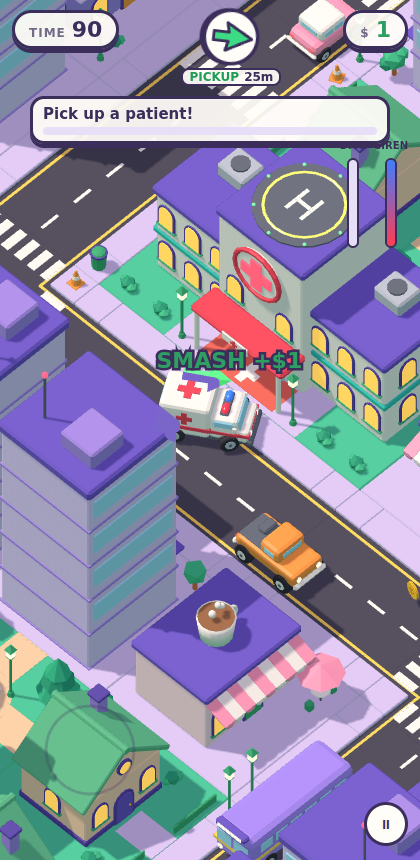

# Gig Ambulance

A cute, low-poly, isometric rush-delivery game for phones. It plays like
*Crazy Taxi*, but you drive an ambulance: pick up patients around a pastel
toy town and race them to the hospital before their timer runs out. You steer
with a virtual thumbstick, as in
[space-lion](https://github.com/mtd-public/space-lion).



- **Game design spec:** [DESIGN.md](DESIGN.md)
- **3D models:** 53 procedural chibi low-poly GLBs built with Blender, in
  [`assets/models`](assets/models). Previews are in
  [`assets/previews`](assets/previews) (see the `sheet_*.png` contact sheets).

## Play the prototype

There's no build step. Serve the folder and open it on a phone, or in a
narrow desktop window:

```
python3 -m http.server 8080
# or: npx http-server -p 8080
```

Then open `http://localhost:8080`.

**Controls**
- **Left thumb:** drag the floating stick toward where you want to go on
  screen. Release to brake.
- **Right thumb:** hold for **Siren Rush** boost.
- **Desktop:** WASD or arrow keys to steer, Space to boost.

Stop inside a **green beam** to load a patient, and inside the **red beam** at
the hospital to deliver. The arrow at the top of the screen always points to
your next stop.

## Rebuild the models

```
pip install bpy pillow
python3 tools/blender/build.py            # GLBs, previews and assets/manifest.json
python3 tools/blender/contact_sheet.py    # category contact sheets
```

See [DESIGN.md §9](DESIGN.md#9-asset-pipeline) for asset conventions such as
axes, node names and metadata.
